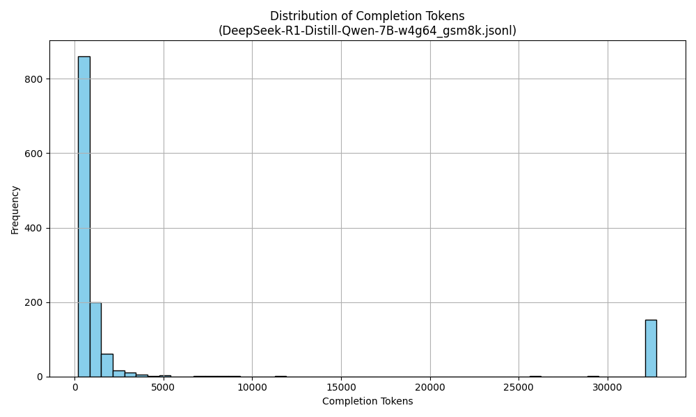
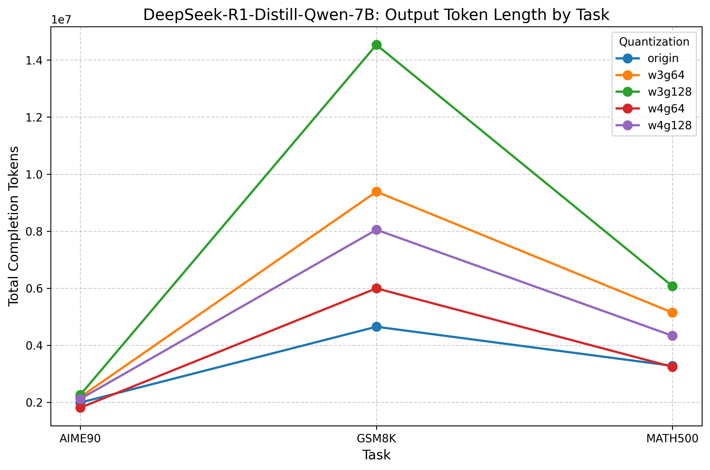

# Quantizaiton-Affects-Token-Length
## Setup
```bash
conda create -n token-length python=3.10 -y
conda activate token-length
pip install vllm==0.7.0 --extra-index-url https://download.pytorch.org/whl/cu124
pip install -r requirements.txt
```
## Results

### Perplexity (PPL) Performance

Perplexity evaluated on **WikiText-2**. Lower is better.

| Model                         | origin | w3g64 | w3g128 | w4g64 | w4g128 |
| ----------------------------- | ------ | ----- | ------ | ----- | ------ |
| DeepSeek-R1-Distill-Qwen-1.5B | 40.46  | 63.01 | 74.93  | 49.56 | 45.85  |
| DeepSeek-R1-Distill-Qwen-7B   | 25.07  | 33.09 | 35.54  | 26.39 | 27.38  |

---

> **Note**: It might be strange that w4g128's ppl is lower than w4g64's—perhaps this is accidental. I have double-checked the setting to ensure that I didn't mix them up.

### Output Length on Reasoning Tasks

Total completion tokens generated across different reasoning benchmarks.  
**Note**: All runs use a maximum output length of **32,768 tokens**. If a sample hits this limit, its true output may be longer.

#### DeepSeek-R1-Distill-Qwen-1.5B

| Task   | origin    | w3g64     | w3g128    | w4g64     | w4g128    |
| ------ | --------- | --------- | --------- | --------- | --------- |
| AIME90 | 2,480,721 | 2,651,688 | 2,174,313 | 2,714,639 | 2,584,694 |

---

> **Note**: Other tasks like GSM8K or MATH500 may take too long to run (GSM8K takes about 9 hours on a single A100), and I expect the results would be similar to those of DeepSeek-R1-Distill-Qwen-7B.

#### DeepSeek-R1-Distill-Qwen-7B

| Task    | origin    | w3g64     | w3g128     | w4g64     | w4g128    |
| ------- | --------- | --------- | ---------- | --------- | --------- |
| AIME90  | 1,991,593 | 2,186,619 | 2,263,423  | 1,812,381 | 2,120,430 |
| GSM8K   | 4,649,575 | 9,385,762 | 14,534,748 | 5,995,580 | 8,050,475 |
| MATH500 | 3,280,053 | 5,146,978 | 6,069,503  | 3,244,191 | 4,333,182 |

---

### Samples Hitting Maximum Token Limit

Number of samples that reached the **32,768-token output limit**, indicating potentially truncated responses.

| Model                         | Task    | origin | w3g64 | w3g128 | w4g64 | w4g128 |
| ----------------------------- | ------- | ------ | ----- | ------ | ----- | ------ |
| DeepSeek-R1-Distill-Qwen-1.5B | AIME90  | 72     | 64    | 50     | 79    | 72     |
| DeepSeek-R1-Distill-Qwen-7B   | AIME90  | 53     | 62    | 65     | 46    | 58     |
|                               | GSM8K   | 108    | 246   | 415    | 152   | 204    |
|                               | MATH500 | 72     | 136   | 163    | 70    | 106    |

---

> **Note**: AIME90, GSM8K, and MATH500 contain 90, 1,319, and 500 test samples, respectively.
> **Interpretation**: A higher count suggests the model tends to generate longer reasoning chains on that task. The true output length may be underestimated for these samples.

### Output Length Distribution

The output length distribution exhibits a **bimodal pattern**, indicating that most model responses fall into one of two categories: either the reasoning process **completes naturally**, or the generation **enters a repetitive loop** before termination. This suggests that the maximum output limit of 32,768 tokens is sufficiently large—it captures the full behavior of the model without prematurely truncating most valid completions.

As an example, the output length distribution for **DeepSeek-R1-Distill-Qwen-7B (w4g64)** on the **GSM8K** benchmark is shown below:



> **Note**: The complete set of distribution plots for all models and configurations can be found in the `png/` folder.

### Conclusion

There is an approximate inverse relationship between quantization quality and output length: better-quantized models tend to generate shorter responses, while degraded quantizations often lead to longer outputs. This trend is **consistently observed on larger datasets** such as GSM8K, where the total output length reliably reflects quantization fidelity. However, on **smaller datasets like AIME90**, the signal becomes noisy—occasionally, higher-quality quantizations may yield longer outputs or vice versa—making it difficult to distinguish model performance based solely on output length.

